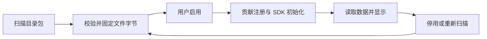

# Lumi 插件开发指南

本文面向**只有已安装的 Lumi 和本指南，没有 Lumi 程序源码**的插件作者。使用普通文本编辑器即可创建、安装和调试下面的插件；不需要克隆仓库、安装 Lumi 开发依赖、复制源码或重新编译 EXE。本文给出了全部示例文件、清单规范、SDK 调用和返回类型。

接口版本为 v1，适用于带有外部插件及独立界面包支持的 Lumi 0.4.35 构建。先确认常规设置中有“额外插件目录”和“界面插件”入口；缺少入口的旧构建需先升级。`schemaVersion`、`hostApiVersion`、`sdk.apiVersion` 当前均为 `1`。

完成第 2–3 节即可做出功能插件；完成第 2、3 节的 LICENSE 和第 7 节即可做出界面插件。SDK 的完整 TypeScript 声明在第 11 节，可直接复制，不依赖任何外部文件。

## 1. 选择插件类型

| 类型 | 位置与文件形式 | 能做什么 | 运行方式 |
| --- | --- | --- | --- |
| 外部功能插件 | 任意工作目录下的 `<ID>/`，JSON + HTML/JS/CSS + LICENSE | 给工作台、用量、模型、令牌、连接、设置顶栏或侧栏提供自己的内容 | 隔离 iframe，通过 SDK 读取受控数据、网络和独立存储 |
| 外部界面插件 | 同上，JSON + CSS + LICENSE | 修改标题栏、侧栏、内容区和状态栏的布局与皮肤 | 宿主校验并应用 CSS，一次启用一个 |

这两类插件都是独立目录包，不进入安装 EXE。制作完毕后复制到 Lumi 的额外插件目录即可运行；开发目录没有固定位置。

工作台、用量分析、模型广场、令牌管理和工具配置是统一系统页面；NewAPI/Codex 等内置接入提供具体内容，浮窗和托盘读取系统展示服务。内置插件由维护者编译发布，其内部接口不属于本指南的外部 SDK。v1 外部插件可贡献视图，但尚不能注册供浮窗/托盘消费的主进程能力、CLI 配置适配器或任意 Node.js 服务。

## 2. 最快开始

准备支持插件的 Lumi 桌面应用和一个保存 UTF-8 文本的编辑器。下面的纯 JavaScript/CSS 示例不需要 Node.js、npm、TypeScript 或其它构建工具。

1. 在任意目录新建 `extension.author.notes` 文件夹。
2. 将第 3 节的五份文件分别保存到该文件夹，不改扩展名；确认不是 `plugin.json.txt`。
3. 在 Lumi 中按下面的安装步骤加载。便笺示例不需要登录、网络或 API 密钥。
4. 显示和保存成功后，再修改名称、功能和插件 ID。

ID 格式为 `extension.<作者>.<名称>`，后两段各以小写字母开头，后续仅允许小写字母、数字、短横线，各段最长 40 个字符。建议文件夹名与 ID 一致，不使用内置插件 ID。界面插件按第 7 节创建三份文件，LICENSE 使用第 3 节的完整文本。

### 安装到已运行的 Lumi

1. 打开常规设置 → 插件 → 额外插件目录 → “打开目录”。
2. 复制完整包文件夹到该目录，例如 `<额外插件目录>/extension.author.notes/plugin.json`。不要多套一层父目录。
3. 点击“重新扫描”，检查诊断信息。
4. 功能插件用滑块启用；界面插件在“界面插件”中选择。

“重新扫描”就是已安装程序自带的包校验入口；不需要仓库检查脚本。格式不合法、缺入口/许可或重复 ID 时会显示诊断，修正后再扫描。目录包是目前的分发形式；如果收到 ZIP，先手动解压，再复制插件目录，没有 ZIP 自动安装或在线市场。

可以直接在额外插件目录编辑文件，也可在自己的工作目录编辑后复制覆盖。每次修改后重新扫描并重新启用；不是修改后立即热更新。

## 3. 功能插件：完整最小示例

下面的便笺插件不需要网络或账户，提供工作台卡片、侧栏页面和设置顶栏。不同视图共享同一包的存储，但各自运行在独立 iframe 中。

```text
extension.author.notes/
  plugin.json
  index.html
  app.js
  style.css
  LICENSE
```

### plugin.json

```json
{
  "schemaVersion": 1,
  "hostApiVersion": 1,
  "kind": "feature",
  "id": "extension.author.notes",
  "name": "我的便笺",
  "version": "1.0.0",
  "description": "在工作台、侧栏和设置中编辑个人便笺。",
  "author": "Author",
  "license": "MIT",
  "permissions": ["storage"],
  "switches": [
    {"id": "card", "title": "工作台便笺", "defaultEnabled": true}
  ],
  "contributions": [
    {"id": "card", "slot": "workbench", "title": "便笺", "entry": "index.html", "scope": "independent", "order": 200, "switch": "card"},
    {"id": "page", "slot": "sidebar", "title": "便笺", "entry": "index.html", "section": "workspace"},
    {"id": "settings", "slot": "settingsTab", "title": "便笺", "entry": "index.html"}
  ]
}
```

### index.html

```html
<!doctype html>
<html lang="zh-CN">
<head>
  <meta charset="UTF-8">
  <meta name="viewport" content="width=device-width, initial-scale=1">
  <link rel="stylesheet" href="style.css">
  <script src="lumi-sdk.js" defer></script>
  <script src="app.js" defer></script>
</head>
<body>
  <label for="note">便笺</label>
  <textarea id="note" rows="4" disabled></textarea>
  <button id="save" disabled>保存</button>
  <p id="status" role="status">正在读取…</p>
</body>
</html>
```

`lumi-sdk.js` 由宿主提供，不要复制或写入包目录。入口放在包根目录时可直接引用该路径；子目录入口应使用相对包根的路径，例如 `../lumi-sdk.js`。

### app.js

```js
const sdk = window.lumiExtension;
const note = document.getElementById('note');
const save = document.getElementById('save');
const status = document.getElementById('status');
let unsubscribe;

function applyContext(context) {
  document.documentElement.dataset.theme = context.theme;
}

async function start() {
  const {context} = await sdk.ready;
  applyContext(context);
  unsubscribe = sdk.onContext(applyContext);
  const stored = await sdk.storage.read('note');
  note.value = typeof stored === 'string' ? stored : '';
  note.disabled = false;
  save.disabled = false;
  status.textContent = '';
}

save.addEventListener('click', async () => {
  save.disabled = true;
  try {
    await sdk.storage.write('note', note.value);
    status.textContent = '已保存';
  } catch (error) {
    status.textContent = error.message;
  } finally {
    save.disabled = false;
  }
});

window.addEventListener('pagehide', () => unsubscribe?.());
start().catch(error => { status.textContent = error.message; });
```

### style.css 与 LICENSE

```css
:root { color-scheme: light; font: 14px system-ui; }
:root[data-theme="dark"] { color-scheme: dark; }
body { margin: 0; padding: 12px; }
label, textarea { display: block; }
textarea { box-sizing: border-box; width: 100%; margin: 8px 0; }
button { padding: 6px 12px; }
```

将下面完整文本保存为无扩展名的 `LICENSE`。示例选择 MIT；发布自己的插件时把 Author 替换为实际版权人，并按实际年份调整。无需从 Lumi 仓库复制文件。

```text
MIT License

Copyright (c) 2026 Author

Permission is hereby granted, free of charge, to any person obtaining a copy
of this software and associated documentation files (the "Software"), to deal
in the Software without restriction, including without limitation the rights
to use, copy, modify, merge, publish, distribute, sublicense, and/or sell
copies of the Software, and to permit persons to whom the Software is
furnished to do so, subject to the following conditions:

The above copyright notice and this permission notice shall be included in all
copies or substantial portions of the Software.

THE SOFTWARE IS PROVIDED "AS IS", WITHOUT WARRANTY OF ANY KIND, EXPRESS OR
IMPLIED, INCLUDING BUT NOT LIMITED TO THE WARRANTIES OF MERCHANTABILITY,
FITNESS FOR A PARTICULAR PURPOSE AND NONINFRINGEMENT. IN NO EVENT SHALL THE
AUTHORS OR COPYRIGHT HOLDERS BE LIABLE FOR ANY CLAIM, DAMAGES OR OTHER
LIABILITY, WHETHER IN AN ACTION OF CONTRACT, TORT OR OTHERWISE, ARISING FROM,
OUT OF OR IN CONNECTION WITH THE SOFTWARE OR THE USE OR OTHER DEALINGS IN THE
SOFTWARE.
```

安装后，在工作台卡片输入便笺并保存；打开侧栏“便笺”，应能读取已保存内容。在常规设置关闭“工作台便笺”子开关后，卡片消失，但侧栏和设置顶栏“便笺”继续可用。关闭父插件后全部贡献撤回。这就是最小示例的验收步骤。

## 4. 清单字段与贡献点

清单采用严格字段校验，未知字段会被拒绝。外部清单不能增加内置的 `main`、`requires` 或 `provides` 字段。

| 字段 | 要求 / 默认值 |
| --- | --- |
| `schemaVersion`、`hostApiVersion` | 必填，当前只能为 `1` |
| `id` | 必填，`extension.author.name` 格式 |
| `kind` | `feature` / `interface`；省略为 `feature` |
| `name`、`author`、`license` | 必填非空字符串；最多 80 / 100 / 100 字符 |
| `description` | 必填字符串，最多 500 字符 |
| `version` | 必填，`1.0.0` 或 `1.0.0-beta.1` 等三段版本，可带预发行后缀；最多 40 字符 |
| `permissions` | 默认 `[]`，仅支持 SDK 权限表中的值 |
| `networkOrigins` | 默认 `[]`；最多 20 个完整 HTTPS origin；有值时需 `network.read` |
| `switches` | 默认 `[]`，最多 30 个自定义滑块 |
| `contributions` | 默认 `[]`，最多 30 个；功能插件至少声明一个 |
| `interface` | 界面插件必填 `{ "stylesheet": "interface.css" }`；功能插件不能声明 |

### 自定义开关

每项 `switches` 包含 `id`、`title` 和可选 `defaultEnabled`（默认 `true`）。`id` 以小写字母开头，后续允许小写字母、数字、点、短横线，总长最多 80 字符。ID 不可重复。

父滑块启停整个功能插件；子滑块控制引用它的贡献。一个开关可以控制多个贡献，也可以让连接设置保持可见、只隐藏工作台卡片。`switch` 必须引用本包已声明的开关。

### 显示贡献

| `slot` | 宿主放置位置 | 常见用途 |
| --- | --- | --- |
| `workbench` | 工作台卡片 | 外部服务额度、摘要、便笺 |
| `usage` | 用量分析来源标签 | 自定义统计视图 |
| `models` | 模型广场来源内容 | 自定义目录展示 |
| `tokens` | API 令牌页面来源内容 | 自有服务的令牌说明或展示 |
| `connection` | 常规设置“连接”区域 | 外部服务密钥输入、连接说明 |
| `settingsTab` | 设置页顶栏与内容 | 插件自己的详细设置 |
| `sidebar` | 侧栏独立页面 | 独立功能入口 |

贡献必填 `id`、`slot`、`title`、`entry`。`entry` 是包内 `.html` 文件；ID 使用与开关相同的格式，贡献 ID 在包内不能重复。

可选 `order` 默认为 `100`，范围 0–10000；卡片、来源、连接和设置标签按该值排序。当前侧栏按导航分组及注册顺序排列，不保证按贡献的 `order` 排序。`section` 为 `workspace`、`tools` 或 `settings`，用于侧栏，省略时为 `workspace`。

`scope` 默认 `independent`。工作台/用量/模型/令牌内容和侧栏页面的 `site` 视图在站点/账户作用域变化时重挂载；`independent` 视图保持独立生命周期。当前连接和设置顶栏容器不按 scope 自动重挂载，插件应通过 context 更新自行清除旧内容。主进程仍用 `scope: site` 校验这些视图的请求范围。无论挂载方式如何，都需丢弃旧站点的异步结果。

宿主生成 `plugin:<包ID>:<贡献ID>`，不允许覆盖系统页面。`models` / `tokens` 只是显示插槽，不会因此获得 NewAPI 模型读取、令牌读取/创建/修改权限；这些操作目前没有外部 SDK。

## 5. 功能插件 SDK v1

所有调用经 `window.lumiExtension`。`ready` 完成后可读取初始 context 和当前贡献的 `{id, slot}`；`sdk.context` 返回最新 context，`sdk.view` 返回当前视图。`onContext(callback)` 返回取消订阅函数。

```ts
interface Context {
  theme: 'light' | 'dark';
  locale: 'zh-CN';
  site: {id: string; name: string; url: string};
  refreshEpoch?: number;
}
```

context 不包含账户凭据、用户文件路径或会话正文。工作台卡片的刷新操作会更新 `refreshEpoch`；插件可据此刷新，无需创建无限后台轮询。主题已解析为浅色/深色，而非 `system`。

| 清单权限 | SDK 方法 | 返回 / 行为 |
| --- | --- | --- |
| 无 | `ready`、`context`、`view`、`onContext(fn)` | 初始化、展示上下文及订阅 |
| `storage` | `storage.read(key)` / `write(key, value)` | 包独立 JSON 数据；不存在返回 `null` |
| `secrets` | `secrets.has(key)` / `set(key, value)` | 检查/保存独立加密凭据；传 `null` 删除；不返回明文 |
| `network.read` | `network.read({url, headers?, secret?})` | 受控 HTTPS GET，返回 `{status, body}` |
| `workbench.read` | `workbench.read({force?})` | 系统工作台的菜单栏展示快照 `NativeMenuBarState` |
| `usage.read` | `usage.read({force?})` | 系统用量的浮窗展示快照 `WidgetState` |
| `codex.usage.read` | `codex.readUsage({force?})` | `SubscriptionUsageSnapshot`，依赖 Codex 接入启用 |

`force` 只能为 boolean。当前 `workbench.read` 会传递强制刷新参数；`usage.read` 接受该参数，但读取仍沿用系统浮窗的加载/缓存策略，不承诺绕过缓存。

### 数据形态

`workbench.read` / `usage.read` 返回展示快照，而非完整 Dashboard、日志、模型目录或完整本地统计：

- 工作台快照含 `siteName`、`accountLabel`、`balance`、`cost`、`tokens`、`requests`、`totalsCaption`、`message` 等展示字段。
- 用量快照含 `siteName`、`balance`、`cost`、`minuteLabel`、`models`、`message`、`updatedAt` 等字段；模型的费用和 Tokens 已格式化为字符串。
- Codex 快照含 `state`、`account`、`windows`、`fetchedAt`；每个窗口含 `primary`、`secondary` 和 `credits`。窗口提供 `usedPercent`、`remainingPercent`、`durationMinutes`、`resetsAt`，积分提供 `remaining`、`unlimited`、`hasCredits`。时间为 Unix 毫秒。

缺失数据可能为 `null` 或展示字符 `—`，不能当成零；不要用格式化余额推算费用或订阅积分。周限额依据 `durationMinutes` 判断，不能假定每个 secondary 窗口都是一周。Codex 需本机 CLI 已登录；插件仅消费接入的读取结果。

这三种快照的全部字段及 SDK 签名都在第 11 节，可直接复制为独立的 `lumi-extension.d.ts`。JavaScript 作者按字段表及上述行为使用即可；不必导入或查看宿主类型。TypeScript 泛型仅提供类型提示，不做返回数据校验。

### 独立存储

存储以包 ID 隔离，由同包不同贡献共享，不会自动按 site 分区。站点相关内容应自行保存为以 `context.site.id` 为索引的 JSON。没有存储变更订阅 API；多视图需要重新读取才能看到其它视图的修改。

键以小写字母开头，后续允许小写字母、数字、点、短横线，最多 80 字符；不要使用 `constructor` 或 `prototype`。总 JSON 文本最多 65536 个字符，按 JavaScript 字符串长度校验。SDK 没有普通存储删除方法，可写入 `null` 表示清空；敏感值使用 secrets，而非 storage。

### 连接、凭据与外部网络

下面是另一份完整功能插件，用自己的连接界面保存密钥，在工作台手动读取服务。创建 `extension.author.service/`，保存以下三份文件，再加入第 3 节的 `style.css` 与 `LICENSE`。该示例不自动请求网络；先将清单 origin 和 JS 中的 URL 换成服务实际的公共 HTTPS GET 接口。

`plugin.json`：

```json
{
  "schemaVersion": 1,
  "hostApiVersion": 1,
  "kind": "feature",
  "id": "extension.author.service",
  "name": "我的服务",
  "version": "1.0.0",
  "description": "在连接设置保存密钥，并在工作台手动读取服务信息。",
  "author": "Author",
  "license": "MIT",
  "permissions": ["secrets", "network.read"],
  "networkOrigins": ["https://api.example.invalid"],
  "contributions": [
    {"id": "connection", "slot": "connection", "title": "我的服务", "entry": "index.html"},
    {"id": "card", "slot": "workbench", "title": "服务信息", "entry": "index.html"}
  ]
}
```

`index.html`：

```html
<!doctype html>
<html lang="zh-CN">
<head>
  <meta charset="UTF-8">
  <link rel="stylesheet" href="style.css">
  <script src="lumi-sdk.js" defer></script>
  <script src="app.js" defer></script>
</head>
<body>
  <div id="connection" hidden>
    <label for="api">服务 API 密钥</label>
    <input id="api" type="password" maxlength="10000" autocomplete="off">
    <button id="save" disabled>保存密钥</button>
    <button id="remove" disabled>删除密钥</button>
  </div>
  <button id="read" hidden disabled>读取服务信息</button>
  <pre id="result" role="status" style="white-space:pre-wrap;overflow-wrap:anywhere"></pre>
</body>
</html>
```

`app.js`：

```js
const sdk = window.lumiExtension;
const input = document.getElementById('api');
const output = document.getElementById('result');
const controls = ['save', 'remove', 'read'].map(id => document.getElementById(id));

async function run(operation) {
  controls.forEach(button => { button.disabled = true; });
  try { await operation(); }
  catch (error) { output.textContent = error.message; }
  finally { controls.forEach(button => { button.disabled = false; }); }
}

document.getElementById('save').addEventListener('click', () => run(async () => {
  if (!input.value.trim()) throw new Error('请输入密钥');
  await sdk.secrets.set('api', input.value.trim());
  input.value = '';
  output.textContent = '已保存；请在工作台手动读取。';
}));
document.getElementById('remove').addEventListener('click', () => run(async () => {
  await sdk.secrets.set('api', null);
  input.value = '';
  output.textContent = '已删除密钥';
}));
document.getElementById('read').addEventListener('click', () => run(async () => {
  const response = await sdk.network.read({
    url: 'https://api.example.invalid/usage',
    headers: {Accept: 'application/json'},
    secret: {key: 'api', header: 'Authorization', prefix: 'Bearer '}
  });
  if (response.status < 200 || response.status >= 300) {
    throw new Error(`服务返回 HTTP ${response.status}`);
  }
  output.textContent = JSON.stringify(JSON.parse(response.body), null, 2);
}));

sdk.ready.then(async ({context, view}) => {
  const theme = value => { document.documentElement.dataset.theme = value.theme; };
  theme(context);
  const unsubscribe = sdk.onContext(theme);
  window.addEventListener('pagehide', unsubscribe);
  document.getElementById('connection').hidden = view.slot !== 'connection';
  document.getElementById('read').hidden = view.slot === 'connection';
  output.textContent = await sdk.secrets.has('api') ? '密钥已设置' : '请先在连接设置中保存密钥';
  controls.forEach(button => { button.disabled = false; });
}).catch(error => { output.textContent = error.message; });
```

安装后，在常规设置“连接”中保存密钥；打开工作台点击“读取服务信息”。`api.example.invalid` 是不可用占位域名，原样运行只验证界面和错误处理，不会获得真实服务数据。服务返回 JSON 的解释由作者按该服务文档实现，Lumi 不推测余额字段。

### 读取系统展示数据

若读取 Lumi 已连接的数据而非自己的外部服务，将清单权限改为所需的 `workbench.read`、`usage.read` 或 `codex.usage.read`。下面的完整 `app.js` 可以替换第 3 节的 JS：同时将其清单 permissions 改成 `["workbench.read"]`，移除不再需要的 card 子开关也可以。

```js
const sdk = window.lumiExtension;
const output = document.getElementById('status');
const read = document.getElementById('save');
document.getElementById('note').hidden = true;
document.querySelector('label').hidden = true;
read.textContent = '刷新余额';
let requestVersion = 0;

async function refresh() {
  const version = ++requestVersion;
  const site = sdk.context.site;
  try {
    const snapshot = await sdk.workbench.read();
    if (version !== requestVersion || sdk.context.site.id !== site.id || sdk.context.site.url !== site.url) return;
    output.textContent = `${snapshot.siteName}：${snapshot.balance} · ${snapshot.message}`;
  } catch (error) {
    if (version === requestVersion) output.textContent = error.message;
  }
}
read.addEventListener('click', refresh);
sdk.ready.then(({context}) => {
  document.documentElement.dataset.theme = context.theme;
  read.disabled = false;
  const unsubscribe = sdk.onContext(next => {
    document.documentElement.dataset.theme = next.theme;
    output.textContent = '正在读取当前连接…';
    void refresh();
  });
  window.addEventListener('pagehide', () => { ++requestVersion; unsubscribe(); });
  void refresh();
}).catch(error => { output.textContent = error.message; });
```

本例读取工作台展示服务；NewAPI 未启用或未登录时按服务错误/未知状态显示，不制造数值。改读 Codex 时使用 `sdk.codex.readUsage()` 和第 11 节的 `SubscriptionUsageSnapshot`，不要把订阅限额与站点余额混合。

### 网络规则

`secret.header` 仅为 `Authorization` / `X-Api-Key`；`prefix` 仅为 `"Bearer "` / `""`，省略默认为 `"Bearer "`。普通 headers 仅允许 Accept、Accept-Language、Authorization、X-Api-Key（大小写不敏感）。secret 使用时还必须声明 `secrets` 权限。

origin 是协议、主机及可选端口，不含路径或末尾斜杠，例如 `https://api.example.invalid:8443`。请求 URL 最长 4000 字符，不含用户名/密码或锚点；header 值最多 4000 字符且不能含换行。secrets 的非空 value 最多 10000 字符。

请求仅允许 GET，不支持 body、POST 或其它写入操作。HTTP 非重定向错误仍返回 status/body，由插件检查；3xx 会拒绝。

宿主拒绝本机/私有地址、重定向和不在声明中的 origin，固定解析后的 DNS 地址并保留 TLS 校验。网络读取最多 15 秒、响应最多 1 MiB；SDK 单视图和宿主单包各限制 8 个在途请求。SDK 调用等待最多 30 秒；该等待超时不等于所有底层操作已取消。

## 6. 生命周期与异步显示



新包默认停用；重新扫描发现任意文件字节变化时也停用，需用户再次启用。不只版本字段变化会触发这一行为。扫描前仍使用上次固定的文件字节，不会随磁盘编辑自动替换资源。

父插件停用撤回全部贡献；子项关闭撤回对应内容。当前设置标签被撤回时回到常规设置。宿主设置页保持挂载，但扫描、启停和子开关变化可能使外部 iframe 重建，外部页面草稿应由插件主动保存。

停用或扫描使旧代次请求/资源失效，停用中止网络读取；站点绑定读取还会校验账户/来源范围。插件仍需用请求序号和站点 ID/URL 防止自己的旧响应覆盖新显示，第 5 节的系统展示示例已经包含这些处理。

外部 UI 使用 sandbox frame，无宿主 DOM、preload、Node、任意 IPC 或文件系统权限。网络走 SDK，不能直接 fetch；没有 worker、嵌套 frame 或表单提交权限。JS 使用包内脚本文件，避免内联脚本、eval 和 CDN 依赖。宿主 SDK 自动测量内容高度，显示范围为 120–3000 px；内容更长时安排内部滚动。

## 7. 界面插件：布局与皮肤

界面包控制已有主窗口外壳的 CSS；不执行脚本、不替换 React 树，也不修改独立浮窗/托盘 renderer。修改内置 JSX 属于内置插件开发。

```text
extension.author.layout/
  plugin.json
  interface.css
  LICENSE
```

### plugin.json

```json
{
  "schemaVersion": 1,
  "hostApiVersion": 1,
  "kind": "interface",
  "id": "extension.author.layout",
  "name": "我的紧凑界面",
  "version": "1.0.0",
  "description": "调整侧栏宽度、间距和强调色。",
  "author": "Author",
  "license": "MIT",
  "interface": {"stylesheet": "interface.css"}
}
```

界面包不能声明非空 permissions、networkOrigins、switches 或 contributions，无需 HTML 或 SDK。清单的 stylesheet 必须指向包内 `.css` 文件。

### interface.css

```css
:scope {
  --sidebar-width: 180px;
  --shell-inset: 12px;
  --accent: #3561b7;
  --accent-soft: rgba(53, 97, 183, .11);
  --accent-hover: #284d98;
}
:scope > .sidebar { border-radius: 12px; padding: 20px 14px; }
:scope > .titlebar { padding-left: 210px; }
:scope.platform-darwin > .titlebar { padding-left: 112px; }
.nav-item { height: 40px; }
.content-container { padding: 18px 20px; }
@media (max-width: 1100px) {
  :scope { --sidebar-width: 164px; }
  .content-container { padding: 16px; }
}
```

宿主包装为 `@scope (.desktop-shell[data-interface="<插件ID>"])`。`:scope` 指向外壳，不能用 `:root`、html 或 body 改全局文档。功能 iframe 的内容有独立样式，主窗口 CSS 不会进入其中。

| 区域 | 选择器 / 变量 |
| --- | --- |
| 外壳 | `:scope`、`--sidebar-width`、`--shell-inset` |
| 平台 | `:scope.platform-win32`、`:scope.platform-darwin` |
| Lumi 当前主题 | `:scope[data-theme="light"]`、`:scope[data-theme="dark"]`（新构建）；颜色可使用 `light-dark(浅色, 深色)`，兼容原有 v1 构建 |
| 标题栏 | `:scope > .titlebar`、`.titlebar-actions`、`.breadcrumb` |
| 侧栏 | `:scope > .sidebar`、`.sidebar-navigation`、`.sidebar-footer`、`.nav-item` |
| 内容 | `.main-area`、`.content-scroll`、`.content-container` |
| 状态栏 | `.app-statusbar` |
| 强调色 | `--accent`、`--accent-soft`、`--accent-hover` |

### 主题与样式覆盖

`@media (prefers-color-scheme: dark)` 读取操作系统主题，不能代表 Lumi 手动选择的主题。界面颜色推荐使用 `light-dark()`，它读取宿主已解析的 `color-scheme`，所以“浅色 / 深色 / 跟随系统”三种设置都能正确切换。新构建还会在外壳同步 `data-theme`，可用于需要分别布局的主题分支。

修改背景时同步语义颜色；只设置 `--accent` 或容器 `color` 不会改变卡片、表格和输入框自己的颜色。可把以下规则加入第 7 节的 `interface.css`，其它文件不变：

```css
:scope {
  --canvas: light-dark(#f4f0ff, #181430);
  --panel: light-dark(#fdfaff, #231c3e);
  --panel-strong: light-dark(#ffffff, #30264e);
  --panel-soft: light-dark(#efe8fa, #30264b);
  --text: light-dark(#3e315d, #f1eaff);
  --text-secondary: light-dark(#645278, #d2c4e9);
  --text-muted: light-dark(#78658b, #b8a6d0);
  --border: light-dark(#dcd0ec, #514269);
  --line: light-dark(#e6ddf1, #44365b);
  --input: light-dark(#fdfaff, #2b2244);
  --hover: light-dark(#eee5fa, #3a2d56);
  --hover-strong: light-dark(#e2d3f5, #4b396e);
  --chart-grid: light-dark(#ded3eb, #514269);
  --chart-fill: light-dark(#ece0fa, #3c2b59);
  --tooltip-bg: light-dark(#ffffff, #30264e);
  color: var(--text);
  background: var(--canvas);
}
```

CSS 按标准优先级叠加，`@scope` 不会自动提高选择器权重。外壳几何使用 `:scope > .sidebar`；原有 v1 构建的 Windows 圆角可使用 `:scope.platform-win32 > .sidebar` 覆盖。默认导航和部分文字声明带有 `!important`，应优先修改上述语义变量；需要为选中项单独指定文字颜色时，使用 `.nav-item.active { color: #fff !important; }`，同时选择有足够对比度的选中背景。不要给全部规则加 `!important`。

继承默认浅/深色语义变量，保持窗口控制可点击、内容可滚动和侧栏位于标题栏下方。CSS 文件最多 64 KiB / 1000 条规则，支持普通/嵌套样式、`@media`、`@supports`。拒绝 `@import`、`@font-face`、url/image-set 资源、app-region 拖动区域属性，以及高于 1000 或非数值的 z-index（允许 auto）。不要添加自己的外层 `@scope`、keyframes 或其它 at-rule。

一次启用一个额外界面；选择新的包会原子停用旧包，选择默认界面会停用当前包。切换/扫描仅改样式，保留设置和功能页节点、草稿、焦点及滚动。缺包或文件变化回到默认；非法 CSS 保留默认布局并提示错误。右下角恢复按钮位于插件作用域外。

本节清单、CSS 和第 3 节 LICENSE 即为完整可运行包。安装后选中“我的紧凑界面”，侧栏应变窄、强调色变蓝；点击恢复默认后还原。不需要额外 JS、HTML、内置界面源码或仓库样例。

## 8. 文件限制与独立构建

| 项目 | 当前限制 |
| --- | --- |
| 每包目录项 | 最多 128，文件与目录都计数 |
| 普通单文件 / 每包总字节 | 2 MiB / 16 MiB |
| plugin.json / 界面 CSS | 各最多 64 KiB |
| 已加载包 / 总字节 | 最多 32 个 / 64 MiB |
| 包内路径 | 最长 240 字符；相对路径，使用 `/` |

目录/文件名使用英文字母、数字、点、下划线、短横线，每段以字母、数字或下划线开头；不能含空格、中文、反斜杠、`..`、绝对路径或符号链接。包内入口资源须真实存在，`LICENSE` 必须非空。

React/Vue/TypeScript 作者在自己的工程构建，将最终自包含 HTML/JS/CSS/资源复制到包中；无需宿主装依赖，不 import Lumi 源码。浏览器可提供的资源类型包括 html/js/mjs/css/json/svg/png/jpg/jpeg/webp/ico/woff/woff2/txt。依赖和素材许可随包提供。

不要把 node_modules、源码依赖树或缓存放进分发包。功能插件资源走包的专用协议，用相对路径，不使用远程脚本/字体或绝对文件路径。作者工程和产物可以分开维护，仓库接收的是完整可运行目录包。

## 9. 调试、更新与验收

修改文件后：复制/覆盖完整包 → 桌面设置重新扫描 → 修正诊断 → 重新启用 → 检查各贡献。没有仓库脚本也能完成这条流程。直接双击 HTML 或用普通浏览器打开不会有 `window.lumiExtension`；功能插件必须在已安装 Lumi 的插件视图中测试。

### 使用已安装程序建立隔离测试环境

可在普通用户配置中安装无网络便笺/界面示例。需要与日常账户和 CLI 会话分开测试时，先完全退出 Lumi，再在 PowerShell 中启动**已安装的可执行文件**：

```powershell
$pluginDevRoot = Join-Path $env:TEMP 'lumi-plugin-development'
$env:LUMI_TEST_DATA = Join-Path $pluginDevRoot 'app'
$env:LUMI_TEST_HOME = Join-Path $pluginDevRoot 'home'
# 将路径换成自己已经安装的 Lumi.exe；不是安装器 EXE。
& 'C:\path\to\Lumi.exe'
```

macOS 可在终端使用同样变量启动已安装应用的二进制：

```sh
LUMI_TEST_DATA="$TMPDIR/lumi-plugin-development/app" \
LUMI_TEST_HOME="$TMPDIR/lumi-plugin-development/home" \
/Applications/Lumi.app/Contents/MacOS/Lumi
```

进入隔离实例的设置，使用该实例的“打开目录”安装插件。变量只对从此 shell 启动的进程生效；测试后退出应用，在新终端或正常应用入口启动即可回到日常环境。这不要求编译程序或修改源码。

### 手动验收

建议验证这些实际行为：

- 各贡献出现在声明的卡片、标签、连接和侧栏位置；子开关只隐藏关联贡献。
- 父插件停用后贡献、设置顶栏和侧栏立即撤回，重新启用不显示旧账户数据。
- 扫描文件变化后包默认停用；未变化的启用状态和独立存储重启后恢复。
- 不同站点、登录/退出、接口失败和未知数值均有正确显示，迟到响应不能回填。
- 界面包在浅/深色、1280/1100 宽度下检查侧栏悬浮、控件、滚动和恢复默认。
- 修改插件时宿主设置页保持挂载；外部 iframe 重建后的草稿恢复策略符合自身设计。

重新扫描检查清单和文件；界面 CSS 的实际合法性和效果在启用时检查。示例把错误显示在插件自己的 status/result 区域，先检查这些文字和扫描诊断。可以先用本地静态数据验证显示，再接入服务；网络 broker 不允许 localhost/私有地址，不以关闭校验的方式连接本地 mock。不要通过收费模型调用测试展示插件。

| 现象 | 排查点 |
| --- | --- |
| 插件没有出现在列表 | 清单错误、缺 LICENSE、路径/大小限制、重复 ID；查看重新扫描诊断 |
| 修改后没有变化 | 文件字节按扫描固定；重新扫描后手动启用 |
| “扩展界面未连接 SDK” | 入口、SDK 相对路径、defer 顺序、脚本 CSP；不要将 lumi-sdk.js 放进包 |
| 请求提示权限不足 | 清单权限、origin 和子开关；显示插槽不自动授予 SDK 权限 |
| 网络读取失败 | 公共 HTTPS、允许请求头、密钥配置、超时/大小及重定向 |
| 旧视图调用被拒绝 | 包/子开关已停用、扫描换代或站点范围变化；重新初始化并读取 |
| 界面回到默认并提示错误 | 受限 CSS 规则、资源引用、拖动属性或 z-index；使用恢复入口 |
| 背景变化但文字/卡片颜色混搭 | 同步 `--text`、`--panel`、`--input` 等语义变量；容器 `color` 不覆盖子控件的显式颜色 |
| Lumi 浅色却显示深色插件 | 将系统主题 media 查询改为 `light-dark()` 或新构建的外壳 `data-theme` 条件 |
| 圆角或选中项颜色未生效 | 检查选择器优先级与宿主 `!important`；按第 7 节的覆盖说明处理 |

## 10. 提交到仓库与分发

完成本地安装验证后即可单独分发整个插件文件夹或 ZIP，并附 README、完整 LICENSE 和界面图。接收者先解压再复制插件目录。提交给 Lumi 仓库是可选的，不影响独立开发/安装，也不要求修改程序注册表。

要贡献官方仓库时，通过 [GitHub 仓库](https://github.com/zhaojiseng/lumi) 将完整目录上传到 `extensions/packages/<ID>/` 并发起 PR；可以使用 GitHub 网页上传文件，不必为了写插件下载全部源码。README/PR 至少包含以下内容：

```text
插件 ID 与版本：
功能及每个显示位置：
数据来源：
每项 permissions / networkOrigins 的用途：
安装、更新、独立构建方式（纯 JS/CSS 可写“无需构建”）：
许可证与依赖/素材许可：
测试的 Lumi 构建、系统、启停/扫描/重启结果：
界面截图：
```

仓库的 `npm run check:extensions` 是维护者/已持有源码者的额外检查，不是无源码作者的开发前提。用户卸载时先停用、移除目录并重新扫描，不应假定插件持久存储同时被删除。

## 11. 完整可复制的 TypeScript 接口

纯 JavaScript 作者不需要此文件。TypeScript 作者将以下代码保存为自己工程中的 `lumi-extension.d.ts` 并纳入 tsconfig 即可获得全部清单、SDK 和数据类型，无需安装 Lumi npm 包或访问程序源码。该声明仅供开发使用，不要将 TypeScript 未编译源码作为运行入口。

```ts
/** Portable author types for the sandboxed Lumi extension SDK v1. No host imports required. */
export type Json = null | boolean | number | string | Json[] | {[key:string]:Json};
export interface Context {theme:'light'|'dark';locale:'zh-CN';site:{id:string;name:string;url:string};refreshEpoch?:number;}
export type ExtensionSlot='workbench'|'usage'|'models'|'tokens'|'connection'|'settingsTab'|'sidebar';
export type ExtensionPermission='workbench.read'|'usage.read'|'codex.usage.read'|'storage'|'network.read'|'secrets';
export interface ExtensionManifest {
  schemaVersion:1;hostApiVersion:1;id:string;kind?:'feature'|'interface';
  name:string;version:string;description:string;author:string;license:string;
  permissions?:ExtensionPermission[];networkOrigins?:string[];
  switches?:{id:string;title:string;defaultEnabled?:boolean}[];
  contributions?:{id:string;slot:ExtensionSlot;title:string;entry:string;order?:number;scope?:'site'|'independent';switch?:string;section?:'workspace'|'tools'|'settings'}[];
  interface?:{stylesheet:string};
}
/** Formatted presentation data, not an account/consumption-log API. */
export interface NativeMenuBarState {
  type:'state';schemaVersion:1;phase:string;siteName:string;accountLabel:string;days:number;tool:string;
  contents:('balance'|'totals'|'tokenDetail'|'efficiency'|'chart'|'models')[];
  totalsCaption?:string;viewKey?:string;
  balance:string;cost:string;tokens:string;requests:string;tokenDetail:string;cacheDetail:string;
  cacheHitRate:string;tokenSpeed:string;message:string;updatedLabel:string;canRefresh:boolean;chartCaption:string;
  chart:{label:string;value:number;cost:string;tokens:string;requests:string}[]|null;
  models:{name:string;cost:string;share:number}[];modelsMessage:string;
}
export interface WidgetModel {name:string;cost:string;requests:string;input:string;output:string;cacheRead:string;cacheWrite:string;}
export interface WidgetState {
  phase:'idle'|'loading'|'ready'|'error';enabled:boolean;siteName:string;balance:string;cost:string;minuteLabel:string;historical:boolean;
  models:WidgetModel[];latestModel?:WidgetModel;message:string;updatedAt:number;viewKey:string;dataKey:string;theme:'light'|'dark';
  animation?:'slide-up'|'slide-down'|'blur'|'fade'|'scale'|'none';source?:'api'|'local';
}
export interface SubscriptionWindow {usedPercent:number|null;remainingPercent:number|null;durationMinutes:number|null;resetsAt:number|null;}
export interface SubscriptionCredits {remaining:number|null;unlimited:boolean|null;hasCredits:boolean|null;}
export interface SubscriptionUsageSnapshot {
  sourceId:'provider.codex';account:{id:string;label:string;plan:string|null}|null;
  state:'ready'|'signed-out'|'unsupported';
  windows:{id:string;label:string;primary:SubscriptionWindow|null;secondary:SubscriptionWindow|null;credits:SubscriptionCredits|null}[];
  fetchedAt:number;
}
export interface LumiExtensionSdk {
  readonly apiVersion:1;
  readonly context:Context|undefined;
  readonly view:{id:string;slot:ExtensionSlot}|undefined;
  readonly ready:Promise<{context:Context;view:NonNullable<LumiExtensionSdk['view']>}>;
  onContext(listener:(context:Context)=>void):()=>void;
  workbench:{read<T=NativeMenuBarState>(input?:{force?:boolean}):Promise<T>};
  usage:{read<T=WidgetState>(input?:{force?:boolean}):Promise<T>};
  codex:{readUsage<T=SubscriptionUsageSnapshot>(input?:{force?:boolean}):Promise<T>};
  storage:{read<T extends Json=Json>(key:string):Promise<T|null>;write(key:string,value:Json):Promise<void>};
  secrets:{has(key:string):Promise<boolean>;set(key:string,value:string|null):Promise<void>};
  network:{read(input:{url:string;headers?:Record<string,string>;secret?:{key:string;header:'Authorization'|'X-Api-Key';prefix?:'Bearer '|''}}):Promise<{status:number;body:string}>};
}
declare global {interface Window {readonly lumiExtension:LumiExtensionSdk;}}
```

这些声明没有 import，复制到独立目录也可使用。以下代码在自己的 TypeScript 工程中应能正常检查；它只是类型提示示例，不是插件额外入口：

```ts
import type {ExtensionManifest} from './lumi-extension';
const manifest: ExtensionManifest = {
  schemaVersion: 1, hostApiVersion: 1, kind: 'interface',
  id: 'extension.author.layout', name: '我的界面', version: '1.0.0',
  description: '独立布局', author: 'Author', license: 'MIT',
  interface: {stylesheet: 'interface.css'}
};
async function inspectTypes() {
  await window.lumiExtension.ready;
  const display = await window.lumiExtension.workbench.read();
  const balance: string = display.balance;
  const quota = await window.lumiExtension.codex.readUsage();
  const credits: number | null | undefined = quota.windows[0]?.credits?.remaining;
  return {manifest, balance, credits};
}
```

## 12. 接口兼容与发布前检查

发布包至少附上支持的 Lumi 构建说明、清单版本、安装方法及权限用途。SDK v1 只提供本文列出的操作；`apiVersion` 与清单声明是兼容标志，不应尝试读取任意宿主对象或追加未文档化方法。响应可能增加字段，作者应只消费需要的字段，并保留 null/未知状态。

在不克隆程序源码的情况下，本文的便笺、外部服务和界面示例均可由列出的文件独立构成。开发、验证、更新和分发都通过目录包与已安装程序完成；向 GitHub 提交是独立的可选步骤。
