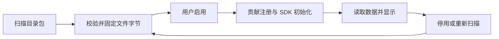

# Lumi 插件开发指南

本文对应 Lumi 0.4.35 的插件接口 v1，面向制作独立插件包的作者，并在最后说明内置插件的开发路径。清单和 SDK 的版本号均为 `1`；这里描述的是当前已实现接口。

## 1. 选择插件类型

| 类型 | 位置与文件形式 | 能做什么 | 运行方式 |
| --- | --- | --- | --- |
| 外部功能插件 | `extensions/packages/<ID>/`，JSON + HTML/JS/CSS + LICENSE | 给工作台、用量、模型、令牌、连接、设置顶栏或侧栏提供自己的内容 | 隔离 iframe，通过 SDK 读取受控数据、网络和独立存储 |
| 外部界面插件 | 同上，JSON + CSS + LICENSE | 修改标题栏、侧栏、内容区和状态栏的布局与皮肤 | 宿主校验并应用 CSS，一次启用一个 |
| 内置插件 | `plugins/<ID>/`，TypeScript/React，可含 main/renderer | 提供特权服务、系统能力、CLI 适配器、桌面表面及系统页面 | 静态装配，随应用编译发布 |

外部包不进入 `dist/`、`app.asar` 或安装 EXE。宿主打包时将它们单独输出到 `release/.../extensions/`；修改外部包不需要重新编译 EXE。

工作台、用量分析、模型广场、令牌管理和工具配置是统一系统页面；NewAPI/Codex 等接入插件提供具体内容。浮窗和托盘消费系统展示服务，默认界面插件负责主窗口外壳。外部插件可贡献视图，但 v1 尚不能注册供浮窗/托盘消费的主进程能力、CLI 配置适配器或任意 Node.js 服务。

## 2. 最快开始

从仓库根目录操作，使用 Node.js 24+、npm 11+。已有开发依赖时跳过安装。

```powershell
npm ci --ignore-scripts
npm run setup:electron

# 功能插件示例
Copy-Item -Recurse extensions/packages/extension.lumi.notes extensions/packages/extension.author.notes

# 或者：界面插件示例
Copy-Item -Recurse extensions/packages/extension.lumi.compact extensions/packages/extension.author.layout
```

修改新目录的 `plugin.json`，设置自己的 `id`、名称、作者、版本和说明。ID 格式为 `extension.<作者>.<名称>`，后两段各以小写字母开头，后续仅允许小写字母、数字、短横线，各段最长 40 个字符。完整目录名建议与 ID 一致。

```powershell
npm run check:extensions -- extensions/packages/extension.author.notes
```

该命令检查清单、文件入口、路径、许可文件和包大小，不会执行插件代码、发出 SDK 网络请求或验证实际布局。

开发桌面应用自动扫描仓库的 `extensions/packages/`。为隔离应用数据及 CLI 配置/会话目录，可在当前 PowerShell 会话设置：

```powershell
$env:LUMI_TEST_DATA = Join-Path $PWD '.test-data/plugin-dev/app'
$env:LUMI_TEST_HOME = Join-Path $PWD '.test-data/plugin-dev/home'
npm run dev
```

开发模式本身不会隔离用户的 CLI home；测试时应同时设置这两个变量。使用模拟数据和假凭据。`npm run dev:web` 只能预览 renderer 的公开信息，无法替代桌面插件协议、加密存储和 IPC 验证。

### 安装到已运行的 Lumi

1. 打开常规设置 → 插件 → 额外插件目录 → “打开目录”。
2. 复制完整包文件夹到该目录，使目录直接包含 `plugin.json`。
3. 点击“重新扫描”，检查诊断信息。
4. 功能插件用滑块启用；界面插件在“界面插件”中选择。

目录包是目前的分发形式；尚无在线市场或 ZIP 自动安装。用户插件目录优先于开发目录或安装资源旁置目录，重复 ID 的后续包会被诊断并跳过。

## 3. 功能插件：完整最小示例

下面的便笺插件不需要网络或账户，提供工作台卡片、侧栏页面和设置顶栏。不同视图共享同一包的存储，但各自运行在独立 iframe 中。

```text
extension.author.notes/
  plugin.json
  index.html
  app.js
  style.css
  LICENSE
```

### plugin.json

```json
{
  "schemaVersion": 1,
  "hostApiVersion": 1,
  "kind": "feature",
  "id": "extension.author.notes",
  "name": "我的便笺",
  "version": "1.0.0",
  "description": "在工作台、侧栏和设置中编辑个人便笺。",
  "author": "Author",
  "license": "MIT",
  "permissions": ["storage"],
  "switches": [
    {"id": "card", "title": "工作台便笺", "defaultEnabled": true}
  ],
  "contributions": [
    {"id": "card", "slot": "workbench", "title": "便笺", "entry": "index.html", "scope": "independent", "order": 200, "switch": "card"},
    {"id": "page", "slot": "sidebar", "title": "便笺", "entry": "index.html", "section": "workspace"},
    {"id": "settings", "slot": "settingsTab", "title": "便笺", "entry": "index.html"}
  ]
}
```

### index.html

```html
<!doctype html>
<html lang="zh-CN">
<head>
  <meta charset="UTF-8">
  <meta name="viewport" content="width=device-width, initial-scale=1">
  <link rel="stylesheet" href="style.css">
  <script src="lumi-sdk.js" defer></script>
  <script src="app.js" defer></script>
</head>
<body>
  <label for="note">便笺</label>
  <textarea id="note" rows="4" disabled></textarea>
  <button id="save" disabled>保存</button>
  <p id="status" role="status">正在读取…</p>
</body>
</html>
```

`lumi-sdk.js` 由宿主提供，不要复制或写入包目录。入口放在包根目录时可直接引用该路径；子目录入口应使用相对包根的路径，例如 `../lumi-sdk.js`。

### app.js

```js
const sdk = window.lumiExtension;
const note = document.getElementById('note');
const save = document.getElementById('save');
const status = document.getElementById('status');
let unsubscribe;

function applyContext(context) {
  document.documentElement.dataset.theme = context.theme;
}

async function start() {
  const {context} = await sdk.ready;
  applyContext(context);
  unsubscribe = sdk.onContext(applyContext);
  const stored = await sdk.storage.read('note');
  note.value = typeof stored === 'string' ? stored : '';
  note.disabled = false;
  save.disabled = false;
  status.textContent = '';
}

save.addEventListener('click', async () => {
  save.disabled = true;
  try {
    await sdk.storage.write('note', note.value);
    status.textContent = '已保存';
  } catch (error) {
    status.textContent = error.message;
  } finally {
    save.disabled = false;
  }
});

window.addEventListener('pagehide', () => unsubscribe?.());
start().catch(error => { status.textContent = error.message; });
```

### style.css 与 LICENSE

```css
:root { color-scheme: light; font: 14px system-ui; }
:root[data-theme="dark"] { color-scheme: dark; }
body { margin: 0; padding: 12px; }
label, textarea { display: block; }
textarea { box-sizing: border-box; width: 100%; margin: 8px 0; }
button { padding: 6px 12px; }
```

提供与声明匹配的完整 `LICENSE`，不要只写“MIT”三个字。可以从仓库示例复制适用的完整许可，并按实际版权归属调整。

## 4. 清单字段与贡献点

清单采用严格字段校验，未知字段会被拒绝。外部清单不能增加内置的 `main`、`requires` 或 `provides` 字段。

| 字段 | 要求 / 默认值 |
| --- | --- |
| `schemaVersion`、`hostApiVersion` | 必填，当前只能为 `1` |
| `id` | 必填，`extension.author.name` 格式 |
| `kind` | `feature` / `interface`；省略为 `feature` |
| `name`、`author`、`license` | 必填非空字符串；最多 80 / 100 / 100 字符 |
| `description` | 必填字符串，最多 500 字符 |
| `version` | 必填，`1.0.0` 或 `1.0.0-beta.1` 等三段版本，可带预发行后缀；最多 40 字符 |
| `permissions` | 默认 `[]`，仅支持 SDK 权限表中的值 |
| `networkOrigins` | 默认 `[]`；最多 20 个完整 HTTPS origin；有值时需 `network.read` |
| `switches` | 默认 `[]`，最多 30 个自定义滑块 |
| `contributions` | 默认 `[]`，最多 30 个；功能插件至少声明一个 |
| `interface` | 界面插件必填 `{ "stylesheet": "interface.css" }`；功能插件不能声明 |

### 自定义开关

每项 `switches` 包含 `id`、`title` 和可选 `defaultEnabled`（默认 `true`）。`id` 以小写字母开头，后续允许小写字母、数字、点、短横线，总长最多 80 字符。ID 不可重复。

父滑块启停整个功能插件；子滑块控制引用它的贡献。一个开关可以控制多个贡献，也可以让连接设置保持可见、只隐藏工作台卡片。`switch` 必须引用本包已声明的开关。

### 显示贡献

| `slot` | 宿主放置位置 | 常见用途 |
| --- | --- | --- |
| `workbench` | 工作台卡片 | 外部服务额度、摘要、便笺 |
| `usage` | 用量分析来源标签 | 自定义统计视图 |
| `models` | 模型广场来源内容 | 自定义目录展示 |
| `tokens` | API 令牌页面来源内容 | 自有服务的令牌说明或展示 |
| `connection` | 常规设置“连接”区域 | 外部服务密钥输入、连接说明 |
| `settingsTab` | 设置页顶栏与内容 | 插件自己的详细设置 |
| `sidebar` | 侧栏独立页面 | 独立功能入口 |

贡献必填 `id`、`slot`、`title`、`entry`。`entry` 是包内 `.html` 文件；ID 使用与开关相同的格式，贡献 ID 在包内不能重复。

可选 `order` 默认为 `100`，范围 0–10000；卡片、来源、连接和设置标签按该值排序。当前侧栏按导航分组及注册顺序排列，不保证按贡献的 `order` 排序。`section` 为 `workspace`、`tools` 或 `settings`，用于侧栏，省略时为 `workspace`。

`scope` 默认 `independent`。工作台/用量/模型/令牌内容和侧栏页面的 `site` 视图在站点/账户作用域变化时重挂载；`independent` 视图保持独立生命周期。当前连接和设置顶栏容器不按 scope 自动重挂载，插件应通过 context 更新自行清除旧内容。主进程仍用 `scope: site` 校验这些视图的请求范围。无论挂载方式如何，都需丢弃旧站点的异步结果。

宿主生成 `plugin:<包ID>:<贡献ID>`，不允许覆盖系统页面。`models` / `tokens` 只是显示插槽，不会因此获得 NewAPI 模型读取、令牌读取/创建/修改权限；这些操作目前没有外部 SDK。

## 5. 功能插件 SDK v1

所有调用经 `window.lumiExtension`。`ready` 完成后可读取初始 context 和当前贡献的 `{id, slot}`；`sdk.context` 返回最新 context，`sdk.view` 返回当前视图。`onContext(callback)` 返回取消订阅函数。

```ts
interface Context {
  theme: 'light' | 'dark';
  locale: 'zh-CN';
  site: {id: string; name: string; url: string};
  refreshEpoch?: number;
}
```

context 不包含账户凭据、用户文件路径或会话正文。工作台卡片的刷新操作会更新 `refreshEpoch`；插件可据此刷新，无需创建无限后台轮询。主题已解析为浅色/深色，而非 `system`。

| 清单权限 | SDK 方法 | 返回 / 行为 |
| --- | --- | --- |
| 无 | `ready`、`context`、`view`、`onContext(fn)` | 初始化、展示上下文及订阅 |
| `storage` | `storage.read(key)` / `write(key, value)` | 包独立 JSON 数据；不存在返回 `null` |
| `secrets` | `secrets.has(key)` / `set(key, value)` | 检查/保存独立加密凭据；传 `null` 删除；不返回明文 |
| `network.read` | `network.read({url, headers?, secret?})` | 受控 HTTPS GET，返回 `{status, body}` |
| `workbench.read` | `workbench.read({force?})` | 系统工作台的菜单栏展示快照 `NativeMenuBarState` |
| `usage.read` | `usage.read({force?})` | 系统用量的浮窗展示快照 `WidgetState` |
| `codex.usage.read` | `codex.readUsage({force?})` | `SubscriptionUsageSnapshot`，依赖 Codex 接入启用 |

`force` 只能为 boolean。当前 `workbench.read` 会传递强制刷新参数；`usage.read` 接受该参数，但读取仍沿用系统浮窗的加载/缓存策略，不承诺绕过缓存。

### 数据形态

`workbench.read` / `usage.read` 返回展示快照，而非完整 Dashboard、日志、模型目录或完整本地统计：

- 工作台快照含 `siteName`、`accountLabel`、`balance`、`cost`、`tokens`、`requests`、`totalsCaption`、`message` 等展示字段。
- 用量快照含 `siteName`、`balance`、`cost`、`minuteLabel`、`models`、`message`、`updatedAt` 等字段；模型的费用和 Tokens 已格式化为字符串。
- Codex 快照含 `state`、`account`、`windows`、`fetchedAt`；每个窗口含 `primary`、`secondary` 和 `credits`。窗口提供 `usedPercent`、`remainingPercent`、`durationMinutes`、`resetsAt`，积分提供 `remaining`、`unlimited`、`hasCredits`。时间为 Unix 毫秒。

缺失数据可能为 `null` 或展示字符 `—`，不能当成零；不要用格式化余额推算费用或订阅积分。周限额依据 `durationMinutes` 判断，不能假定每个 secondary 窗口都是一周。Codex 需本机 CLI 已登录；插件仅消费接入的读取结果。

权威类型见 [`shared/menu-bar.ts`](../shared/menu-bar.ts)、[`shared/widget.ts`](../shared/widget.ts)、[`shared/contracts/subscription-usage.ts`](../shared/contracts/subscription-usage.ts)。作者可复制所需类型到独立工程；SDK 类型文件 [`extensions/sdk/lumi-extension.d.ts`](../extensions/sdk/lumi-extension.d.ts) 不依赖宿主源码。其读取方法的泛型只提供类型提示，不做返回数据校验。

### 独立存储

存储以包 ID 隔离，由同包不同贡献共享，不会自动按 site 分区。站点相关内容应自行保存为以 `context.site.id` 为索引的 JSON。没有存储变更订阅 API；多视图需要重新读取才能看到其它视图的修改。

键以小写字母开头，后续允许小写字母、数字、点、短横线，最多 80 字符；不要使用 `constructor` 或 `prototype`。总 JSON 文本最多 65536 个字符，按 JavaScript 字符串长度校验。SDK 没有普通存储删除方法，可写入 `null` 表示清空；敏感值使用 secrets，而非 storage。

### 连接、凭据与外部网络

为清单增加 `permissions: ["secrets", "network.read"]`、`networkOrigins: ["https://api.example.invalid"]`，并添加一个 `connection` 贡献作为输入界面。下面是调用片段；占位域名需换成服务的真实公共 HTTPS origin。

```js
// 用户在插件自己的连接界面主动保存密钥。
await sdk.secrets.set('api', input.value);
input.value = '';

// 在需要数据时读取；宿主注入加密存储中的密钥。
const response = await sdk.network.read({
  url: 'https://api.example.invalid/usage',
  headers: {Accept: 'application/json'},
  secret: {key: 'api', header: 'Authorization', prefix: 'Bearer '}
});
if (response.status < 200 || response.status >= 300) {
  throw new Error(`服务返回 HTTP ${response.status}`);
}
const data = JSON.parse(response.body);
```

`secret.header` 仅为 `Authorization` / `X-Api-Key`；`prefix` 仅为 `"Bearer "` / `""`，省略默认为 `"Bearer "`。普通 headers 仅允许 Accept、Accept-Language、Authorization、X-Api-Key（大小写不敏感）。secret 使用时还必须声明 `secrets` 权限。

origin 是协议、主机及可选端口，不含路径或末尾斜杠，例如 `https://api.example.invalid:8443`。请求仅允许 GET，不支持 body、POST 或其它写入操作。HTTP 非重定向错误仍返回 status/body，由插件检查；3xx 会拒绝。

宿主拒绝本机/私有地址、重定向和不在声明中的 origin，固定解析后的 DNS 地址并保留 TLS 校验。网络读取最多 15 秒、响应最多 1 MiB；SDK 单视图和宿主单包各限制 8 个在途请求。SDK 调用等待最多 30 秒；该等待超时不等于所有底层操作已取消。

## 6. 生命周期与异步显示



新包默认停用；重新扫描发现任意文件字节变化时也停用，需用户再次启用。不只版本字段变化会触发这一行为。扫描前仍使用上次固定的文件字节，不会随磁盘编辑自动替换资源。

父插件停用撤回全部贡献；子项关闭撤回对应内容。当前设置标签被撤回时回到常规设置。宿主设置页保持挂载，但扫描、启停和子开关变化可能使外部 iframe 重建，外部页面草稿应由插件主动保存。

停用或扫描使旧代次请求/资源失效，停用中止网络读取；站点绑定读取还会校验账户/来源范围。插件仍需防止自己的旧响应覆盖新显示：

```js
let requestVersion = 0;
async function refresh() {
  const version = ++requestVersion;
  const siteId = sdk.context.site.id;
  try {
    const snapshot = await sdk.workbench.read();
    if (version !== requestVersion || sdk.context.site.id !== siteId) return;
    output.textContent = snapshot.balance;
  } catch (error) {
    if (version === requestVersion && sdk.context.site.id === siteId) {
      output.textContent = error.message;
    }
  }
}
```

上面需声明 `workbench.read`，并在 `sdk.ready` 后调用；`output` 是插件自己的 DOM 节点。使用 context 变化和用户刷新触发重读，并按需清除旧站点内容。

外部 UI 使用 sandbox frame，无宿主 DOM、preload、Node、任意 IPC 或文件系统权限。网络走 SDK，不能直接 fetch；没有 worker、嵌套 frame 或表单提交权限。JS 使用包内脚本文件，避免内联脚本、eval 和 CDN 依赖。宿主 SDK 自动测量内容高度，显示范围为 120–3000 px；内容更长时安排内部滚动。

## 7. 界面插件：布局与皮肤

界面包控制已有主窗口外壳的 CSS；不执行脚本、不替换 React 树，也不修改独立浮窗/托盘 renderer。修改内置 JSX 属于内置插件开发。

```text
extension.author.layout/
  plugin.json
  interface.css
  LICENSE
```

### plugin.json

```json
{
  "schemaVersion": 1,
  "hostApiVersion": 1,
  "kind": "interface",
  "id": "extension.author.layout",
  "name": "我的紧凑界面",
  "version": "1.0.0",
  "description": "调整侧栏宽度、间距和强调色。",
  "author": "Author",
  "license": "MIT",
  "interface": {"stylesheet": "interface.css"}
}
```

界面包不能声明非空 permissions、networkOrigins、switches 或 contributions，无需 HTML 或 SDK。清单的 stylesheet 必须指向包内 `.css` 文件。

### interface.css

```css
:scope {
  --sidebar-width: 180px;
  --shell-inset: 12px;
  --accent: #3561b7;
  --accent-soft: rgba(53, 97, 183, .11);
  --accent-hover: #284d98;
}
:scope > .sidebar { border-radius: 12px; padding: 20px 14px; }
:scope > .titlebar { padding-left: 210px; }
:scope.platform-darwin > .titlebar { padding-left: 112px; }
.nav-item { height: 40px; }
.content-container { padding: 18px 20px; }
@media (max-width: 1100px) {
  :scope { --sidebar-width: 164px; }
  .content-container { padding: 16px; }
}
```

宿主包装为 `@scope (.desktop-shell[data-interface="<插件ID>"])`。`:scope` 指向外壳，不能用 `:root`、html 或 body 改全局文档。功能 iframe 的内容有独立样式，主窗口 CSS 不会进入其中。

| 区域 | 选择器 / 变量 |
| --- | --- |
| 外壳 | `:scope`、`--sidebar-width`、`--shell-inset` |
| 平台 | `:scope.platform-win32`、`:scope.platform-darwin` |
| 标题栏 | `:scope > .titlebar`、`.titlebar-actions`、`.breadcrumb` |
| 侧栏 | `:scope > .sidebar`、`.sidebar-navigation`、`.sidebar-footer`、`.nav-item` |
| 内容 | `.main-area`、`.content-scroll`、`.content-container` |
| 状态栏 | `.app-statusbar` |
| 强调色 | `--accent`、`--accent-soft`、`--accent-hover` |

继承默认浅/深色语义变量，保持窗口控制可点击、内容可滚动和侧栏位于标题栏下方。CSS 文件最多 64 KiB / 1000 条规则，支持普通/嵌套样式、`@media`、`@supports`。拒绝 `@import`、`@font-face`、url/image-set 资源、app-region 拖动区域属性，以及高于 1000 或非数值的 z-index（允许 auto）。不要添加自己的外层 `@scope`、keyframes 或其它 at-rule。

一次启用一个额外界面；选择新的包会原子停用旧包，选择默认界面会停用当前包。切换/扫描仅改样式，保留设置和功能页节点、草稿、焦点及滚动。缺包或文件变化回到默认；非法 CSS 保留默认布局并提示错误。右下角恢复按钮位于插件作用域外。完整示例见 [`extension.lumi.compact`](../extensions/packages/extension.lumi.compact/)。

## 8. 文件限制与独立构建

| 项目 | 当前限制 |
| --- | --- |
| 每包目录项 | 最多 128，文件与目录都计数 |
| 普通单文件 / 每包总字节 | 2 MiB / 16 MiB |
| plugin.json / 界面 CSS | 各最多 64 KiB |
| 已加载包 / 总字节 | 最多 32 个 / 64 MiB |
| 包内路径 | 最长 240 字符；相对路径，使用 `/` |

目录/文件名使用英文字母、数字、点、下划线、短横线，每段以字母、数字或下划线开头；不能含空格、中文、反斜杠、`..`、绝对路径或符号链接。包内入口资源须真实存在，`LICENSE` 必须非空。

React/Vue/TypeScript 作者在自己的工程构建，将最终自包含 HTML/JS/CSS/资源复制到包中；无需宿主装依赖，不 import Lumi 源码。浏览器可提供的资源类型包括 html/js/mjs/css/json/svg/png/jpg/jpeg/webp/ico/woff/woff2/txt。依赖和素材许可随包提供。

不要把 node_modules、源码依赖树或缓存放进分发包。功能插件资源走包的专用协议，用相对路径，不使用远程脚本/字体或绝对文件路径。作者工程和产物可以分开维护，仓库接收的是完整可运行目录包。

## 9. 调试、更新与验收

修改外部文件后：运行包检查 → 桌面设置重新扫描 → 重新启用 → 检查各贡献。修改 main/preload 或内置插件时需要重启开发进程；Vite 热更新不能替代 Electron 重启。

建议验证这些实际行为：

- 各贡献出现在声明的卡片、标签、连接和侧栏位置；子开关只隐藏关联贡献。
- 父插件停用后贡献、设置顶栏和侧栏立即撤回，重新启用不显示旧账户数据。
- 扫描文件变化后包默认停用；未变化的启用状态和独立存储重启后恢复。
- 不同站点、登录/退出、接口失败和未知数值均有正确显示，迟到响应不能回填。
- 界面包在浅/深色、1280/1100 宽度下检查侧栏悬浮、控件、滚动和恢复默认。
- 修改插件时宿主设置页保持挂载；外部 iframe 重建后的草稿恢复策略符合自身设计。

仓库已有回归命令：

```powershell
npm run pretest
node --import tsx --test tests/extensions.test.ts tests/interface-plugin-ui.test.ts tests/renderer-plugins.test.ts

# 宿主代码变更再检查类型及真实构建后的桌面 IPC。
npm run typecheck
npm run build
npm run test:desktop
```

这些既有测试不会自动覆盖你新增包的业务。包检查不执行 CSSOM 校验；界面 CSS 的实际合法性和效果还需在桌面启用验证。使用隔离数据、mock 服务和假凭据，不用真实 CLI 配置或收费模型调用测试。

| 现象 | 排查点 |
| --- | --- |
| 插件没有出现在列表 | 清单错误、缺 LICENSE、路径/大小限制、重复 ID；查看重新扫描诊断 |
| 修改后没有变化 | 文件字节按扫描固定；重新扫描后手动启用 |
| “扩展界面未连接 SDK” | 入口、SDK 相对路径、defer 顺序、脚本 CSP；不要将 lumi-sdk.js 放进包 |
| 请求提示权限不足 | 清单权限、origin 和子开关；显示插槽不自动授予 SDK 权限 |
| 网络读取失败 | 公共 HTTPS、允许请求头、密钥配置、超时/大小及重定向 |
| 旧视图调用被拒绝 | 包/子开关已停用、扫描换代或站点范围变化；重新初始化并读取 |
| 界面回到默认并提示错误 | 受限 CSS 规则、资源引用、拖动属性或 z-index；使用恢复入口 |

## 10. 提交到仓库与分发

1. 将可运行包放在 `extensions/packages/<ID>/`，附 README、完整 LICENSE 和使用界面图。
2. README 写清用途、每个贡献、数据来源、权限及 origin、构建方式、安装和更新方法。
3. 运行 `npm run check:extensions`，确认其它包也能扫描；完成自己功能的隔离验证。
4. 提交 PR，使用 [额外插件模板](../.github/PULL_REQUEST_TEMPLATE/extension.md)，说明 ID/版本、权限依据和验证结果。

新增外部包不需要修改内置注册表。合并后的包可独立分发；宿主打包脚本导出仓库中通过校验的包，发布校验比对独立包与仓库字节。用户复制文件夹安装；卸载时先停用、移除目录并重新扫描，不应假定持久存储同时被删除。

## 11. 内置插件开发路径

此部分面向修改 Lumi 源码的维护者。内置 main 代码受信任并静态装配；manifest 权限声明本身不是安全沙箱，不能将外部文件直接 import 到主进程。

### 主进程能力与依赖

`PluginManifest` 声明 `id`、`version`、`hostApiVersion: 1`、`configurable`、`requires`、`optional`、`provides` 和可选 `settings`。依赖使用 `{sourceId, capability}`，sourceId 是插件 ID，不是站点 ID。设置组声明 `title`、`description`、`order`、`views`，宿主据此生成父/子滑块。

例如 Codex 接入的现有声明提供 `subscriptionUsage.read`，工作台 view 可单独隐藏；其 main 激活流程如下：

```ts
// 节选自 plugins/provider.codex/main.ts。
return {
  manifest: codexProviderManifest,
  activate(context) {
    const service = new CodexUsageService({resolve});
    context.provide('subscriptionUsage.read', {read: input => service.read(input)});
    context.onDispose(() => service.close());
  }
};
```

`activate` 可返回清理函数，或通过 `onDispose` 注册多个资源清理；清理逆序执行。必需依赖自动启用，提供者停用先停必需消费者；可选依赖不会自动启用。能力调用有代次检查，停用后的旧引用与迟到结果失效。

### Renderer 贡献

`RendererContribution` 提供 workbench、usage、models、tokens、toolConfigs、connections、settingsTabs、sidebar 和自定义 settings.component。组件静态导入或 React.lazy 加载；view 必须在 manifest.settings.views 中声明。

连接/设置标签 ID 使用 `plugin:<manifest.id>:<name>`；sidebar 的 page/navigation ID 一致且使用该命名空间。系统卡片声明 site/independent 范围；只让站点绑定内容随账号切换重建。

| 要做的修改 | 接入位置 |
| --- | --- |
| 增加插件元数据 | `plugins/<ID>/manifest.ts` → `plugins/manifests.ts`，此入口仅导出元数据 |
| 增加 main 服务 | `plugins/<ID>/main.ts` → `electron/host/plugins.ts`，同时调整 implemented 列表 |
| 增加 renderer 贡献 | `plugins/<ID>/renderer.tsx` → `src/host/renderer-registry.ts` |
| 增加能力类型 | `shared/contracts/`、BuiltinCapabilityMap / BUILTIN_CAPABILITY_IDS |
| 增加特权 UI 操作 | 窄 DTO、LumiBridge、preload、校验的 main handler、service、browser fallback |
| 调整默认主窗口外壳 | `plugins/interface.default/` 与 `src/host/interface.tsx` 的 InterfaceShellProps |
| 调整浮窗/托盘运行时 | 相应 surface 插件；保持独立受限 preload 和窗口资源清理 |

新 API 沿用固定类型化 IPC，校验参数和主窗口 sender/frame/origin，不能暴露通用 invoke 或文件路径。能力/服务/renderer 边界不得把 Node 或凭据代码带入 renderer bundle。

保持设置页实例稳定，父子开关不通过 bootstrap 重载实现；撤回页面不能被退出动画保留。NewAPI 的令牌服务和专用配钥策略仍由 NewAPI 拥有，Tools 消费能力而非令牌页面。直接 CLI 配置继续使用预览、加密备份、冲突检查、原子写入和回滚；本地分析保持只读。

完整宿主架构见 [PLUGINS.md](PLUGINS.md)，实际类型见 [插件合约](../shared/contracts/plugins.ts) 和 [Renderer 注册表](../src/host/renderer-registry.ts)。新增内置服务需相应生命周期/作用域/权限回归，不以单纯移动目录作为完成标准。
